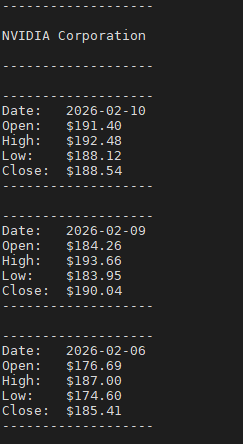
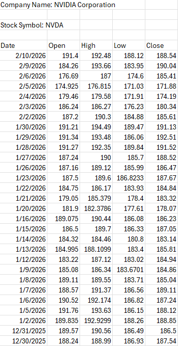
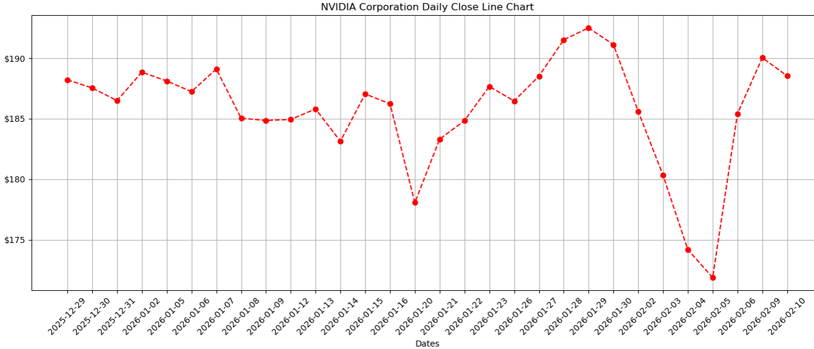
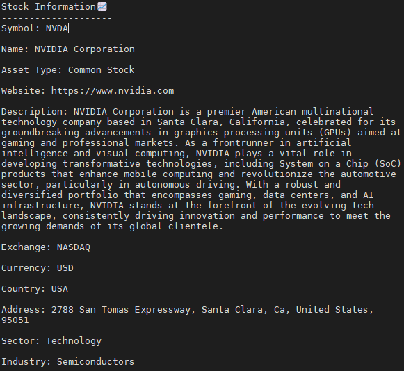

# SMAI 

SMAI is a Python console application that retrieves, analyzes, and visualizes stock market data using the [Alpha Vantage API](https://www.alphavantage.co/documentation/).  

<table align="center">
    <tr>
        <td>
            
        </td>
        <td>
            
        </td>
        <td>
            
        </td>
        <td>
               
        </td>
    </tr>
</table>

I was the project lead, I came up with the design of the application and implemented the core logic, API integration, and visualization features.

## 🚀 Features

Get a master list of stock symbols 

- Fetch **daily** and **monthly** time series data for any stock symbol  
- Generate **matplotlib** line charts for visual analysis  
- Export **daily** and **monthly** stock data to **CSV** for Excel use  
- Retrieve **company overview** information 
- Provide **simple investment advice** based on market trends and professional analyst's ratings

---

## 🧰 Technologies Used

- Python 3.12
- Requests (API calls)  
- Matplotlib (visualization)  
- CSV module (data export)

---
## 📄 Documentation
- [Presentation Slides](docs/StockMarketTool_Presentation.pdf)

