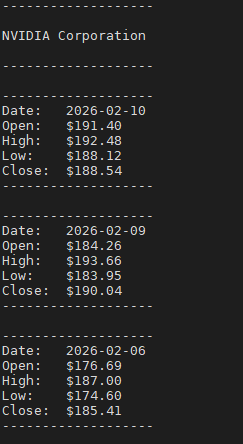
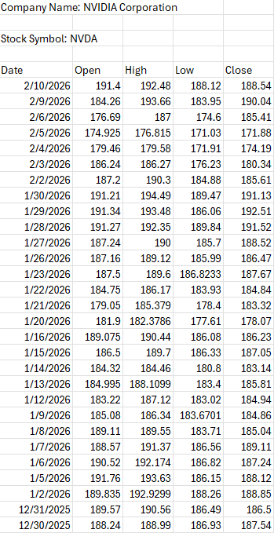
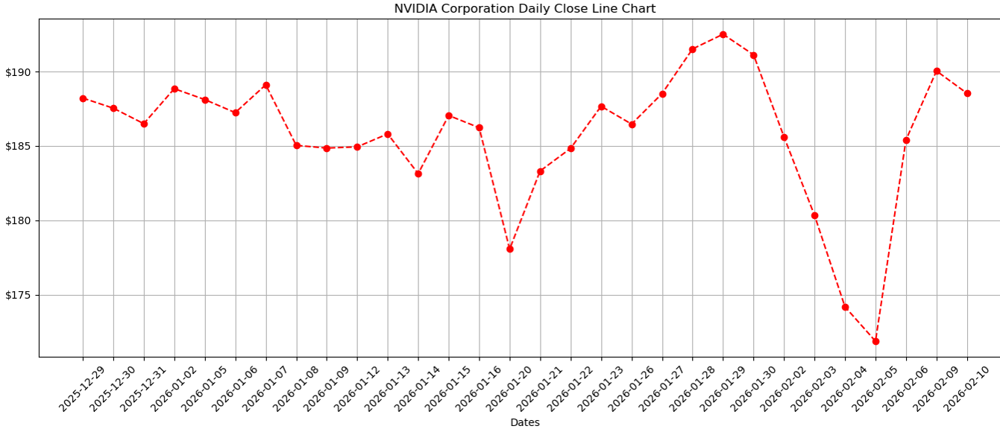
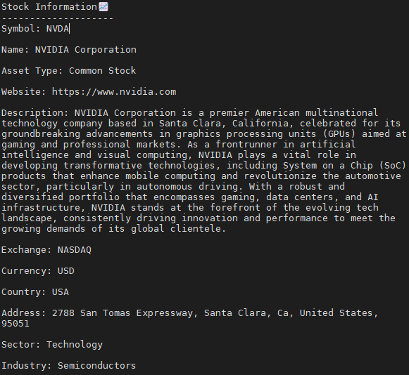
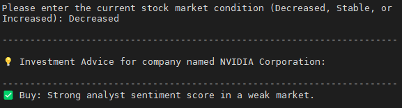

[](https://www.alphavantage.co/support/#support)

<p align="center">

</p>

# SMAI
SMAI is a Python console application that retrieves, analyzes, and visualizes stock market data using the [Alpha Vantage API](https://www.alphavantage.co/documentation/).

---

# Project Features
* Get a master list of stock symbols.
* Fetch **daily** and **monthly** time series data for any stock symbol.
* Generate **matplotlib** line charts for visual analysis.
* Export **daily** and **monthly** stock data to **CSV** for Excel use.
* Retrieve **company overview** information.
* Provide **simple investment advice** based on market trends and professional analyst's ratings.

---

<table align="center">
    <tr>
        <td>
            
        </td>
        <td>
            
        </td>
        <td>
            
        </td>
        <td>
            
        </td>
        <td>
            
        </td>
    </tr>
</table>

---

# Technologies / Modules Used
* Python 3.12
* Requests (API calls)
* Matplotlib (visualization)
* CSV (data export)
* OS (config.txt API key management)

---

## ⚙️ Setup & Installation

### Option 1 — Clone with Git (Recommended)

**1. Clone the repository**
```bash
git clone https://github.com/misb1280/stockmarkettool.git
cd stockmarkettool
```

**2. Install the required dependencies**
```bash
pip install -r requirements.txt
```

**3. Get your free Alpha Vantage API key**

Click the Alpha Vantage badge at the top of this page or visit the [API Key Page](https://www.alphavantage.co/support/#api-key) to claim your free key.

> ⚠️ **API Call Limit:** The free Alpha Vantage API tier allows **25 requests per day**. Here is how many calls each action uses per session:
> - Entering or changing a stock symbol: **1 call**
> - Viewing monthly stock data: **1 call**
> - Viewing daily stock data: **1 call**
> - Viewing company info: **1 call** 
> - Getting investment advice: **1 call** 
>
> A full session viewing everything on a single stock costs a maximum of **5 calls**.

**4. Run the program and enter your API key**
```bash
python src/SMAI_V1.1.0.py
```
On first launch you will be prompted to enter your Alpha Vantage API key. 
It will be saved automatically to `config.txt` for all future sessions.

> ⚠️ **Note:** Never share or commit your `config.txt` file as it contains 
> your personal API key.

---

### Option 2 — Manual Download

1. Click the green **Code** button at the top of this page
2. Select **Download ZIP** and extract it
3. Open `src/SMAI_V1.1.0.py` in your IDE of choice
4. Follow steps 3–4 from Option 1 above

### Requirements
- Python 3.12+
- A free [Alpha Vantage API key](https://www.alphavantage.co/support/#api-key)

---

# Video Demonstrations

## Stock Selection
https://github.com/user-attachments/assets/eab605fb-0d4c-4aa0-ad8b-5b1da0c6ac1f

## Daily Stock OHLC Values + Line Chart
https://github.com/user-attachments/assets/9422349f-6af0-4859-b2a0-685b5dad5872

## Stock Overview
https://github.com/user-attachments/assets/80dfdc8f-1875-4e2d-81e0-9afb2c00e246

## Investment Advice
https://github.com/user-attachments/assets/2637cf5f-7046-40a7-93fb-64bc41ae2334

---

# 🔮 Future Features
* Generative AI integration for deeper stock analysis and insights
* Improved investment recommendation system
* Additional data visualizations

---

# Project Documentation
* [Presentation Slides](docs/StockMarketTool_Presentation.pdf)

---

# Helpful Links
* [AlphaVantage API documentation](https://www.alphavantage.co/documentation/)
* [AlphaVantage API key](https://www.alphavantage.co/support/#api-key)
* [GroqCloud API documentation](https://console.groq.com/docs/overview)
* [GroqCloud API key](https://console.groq.com/keys)

---

# About
Michael Spano was the project lead, responsible for the design of the application and implementation of the core logic, API integration, and visualization features.
